<h1 align="center">Mohamed ELYOUSFI</h1>
<h2 align="center"><💻 Compte Rendu des Travaux Pratiques Micro-Services💻/></h2>  

    
Semaine1 - Creation d'un micro-service bank-account-service (cliquez  🖱) <a href="https://github.com/ElyousfiMohamed/Micro-Services-avec-Spring-Cloud/tree/master/Semaine%201/bank-account-service"> [Code source]</a>

    

        <h3>Entities</h3>
        <h5>- Entity BankAccount</h5>
        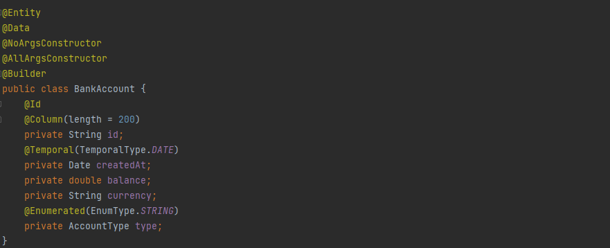
	<h5>- Enum AccountType</h5>
        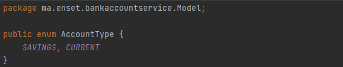
	<h3>Repositories</h3>
        <h5>- BankAccount Repository</h5>
        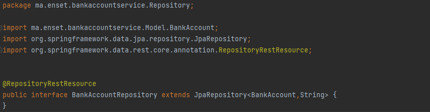
  <h3>Dto</h3>
        <h5>- BankAccount Dto</h5>
        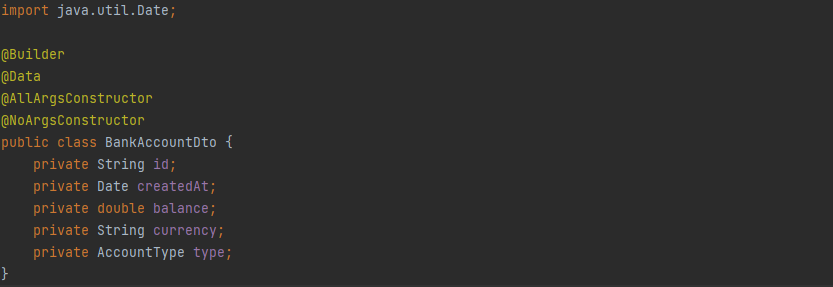
  <h3>Mapper</h3>
        <h5>- BankAccount Mapper</h5>
        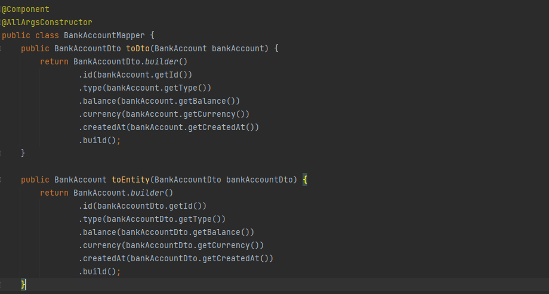
        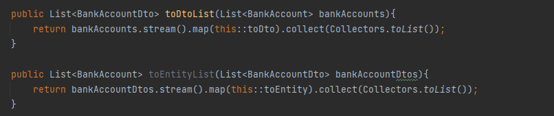
  <h3>Exception</h3>
        <h5>- BankAccountNotFound Exception</h5>
        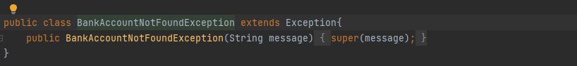
	<h3>Services</h3>
	<h5>- Service BankAccount</h5>
        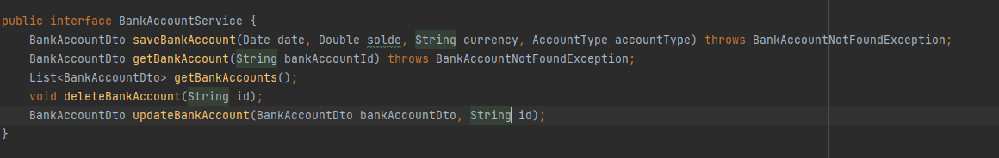
  <h5>- Implementation</h5>
        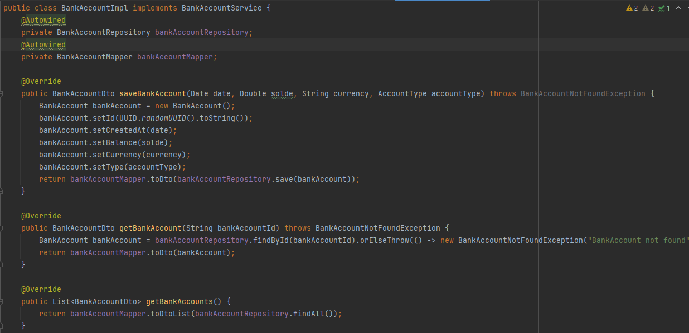
        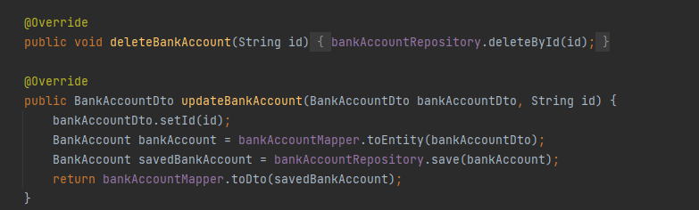
	<h3>Controllers</h3>
        <h5>- BankAccount Controller</h5>
        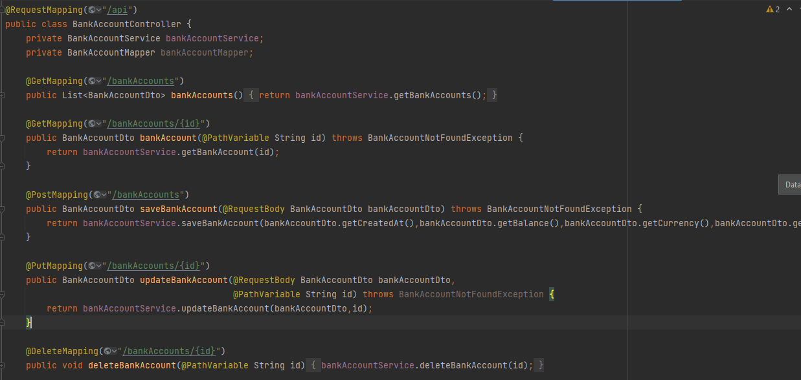
	<h3>Insertion données de test</h3>
        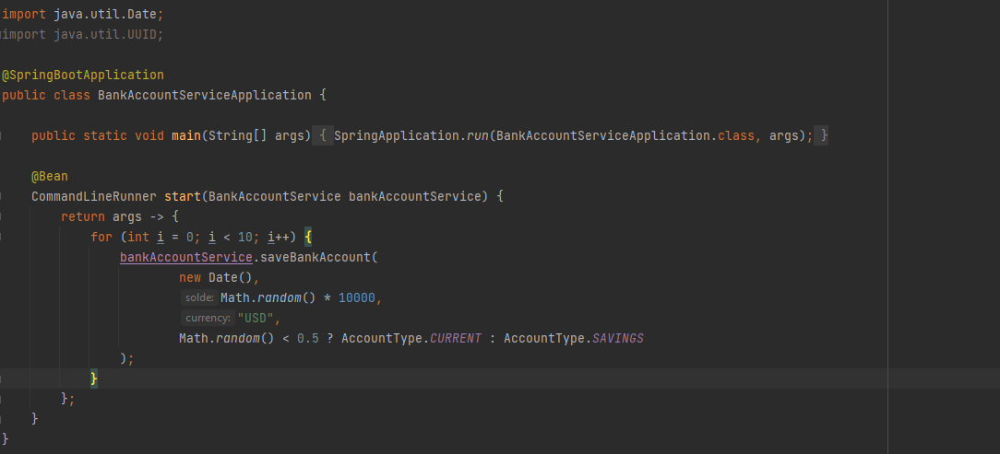
  <h3>Documentation Swagger</h3>
        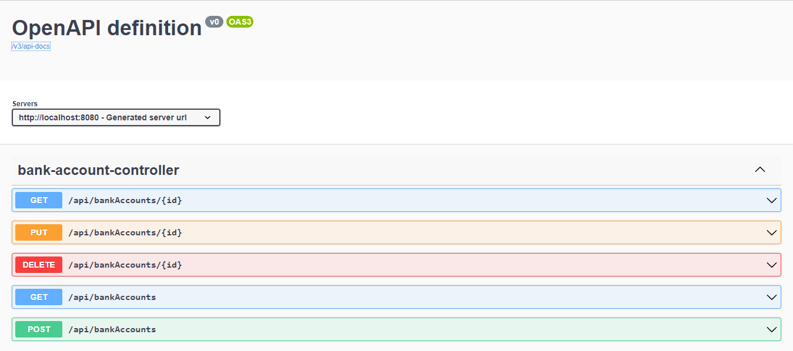
	<h3>API (postman)</h3>
        <h5>- getAllBankAccounts</h5>
        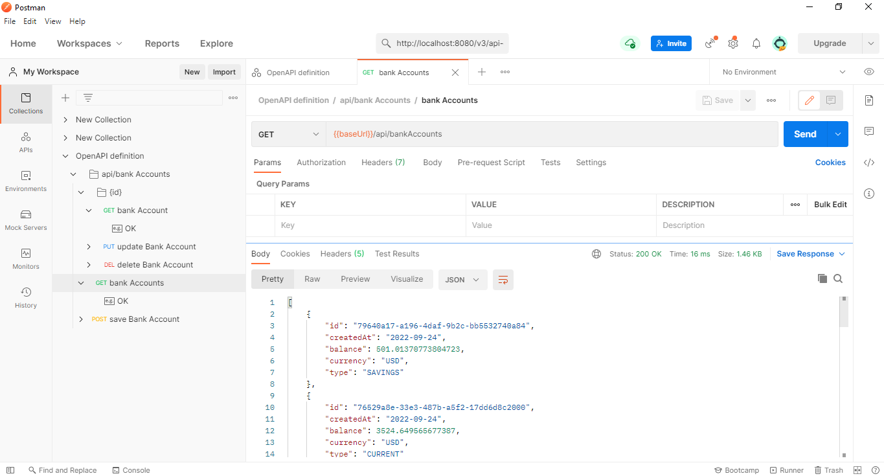
        <h5>- getBankAccountById</h5>
        
        <h5>- addBankAccount</h5>
        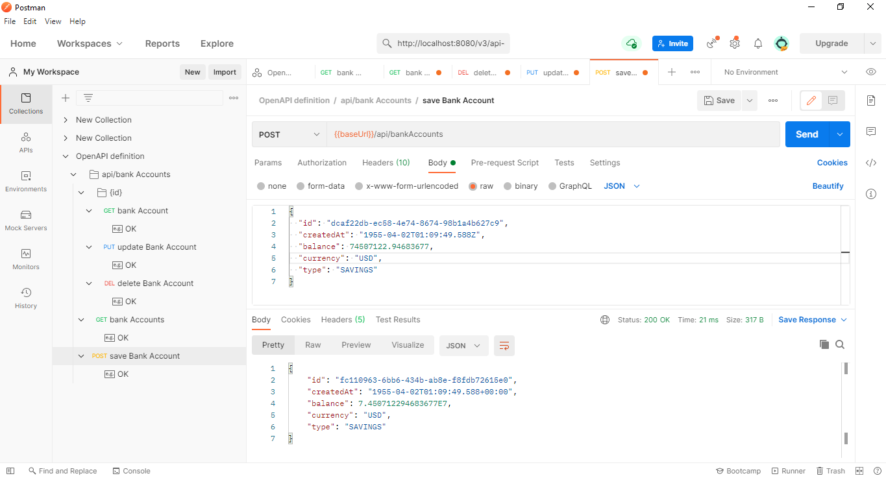
        <h5>- updateBankAccount</h5>
        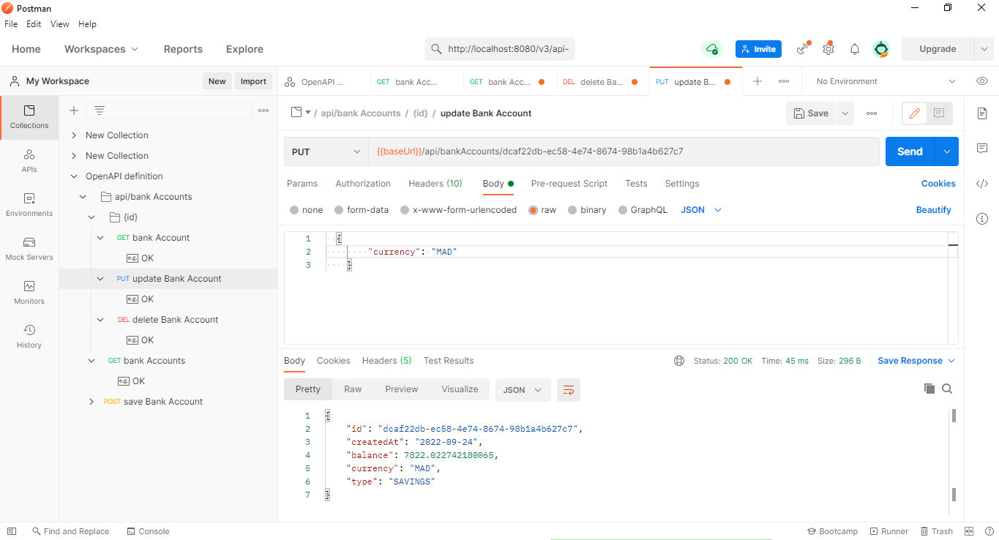
        <h5>- deleteBankAccount</h5>
        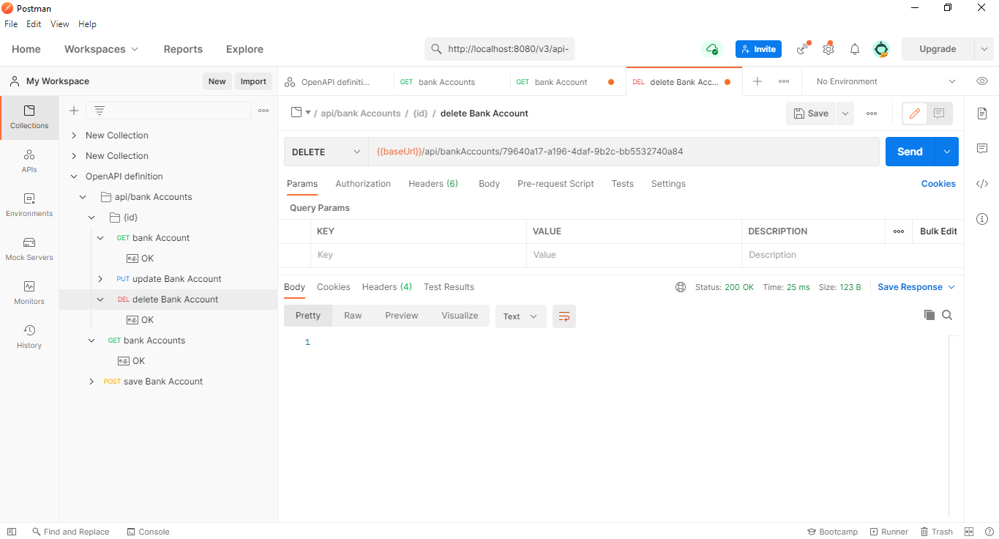
    

---

<h3>...</h3>

